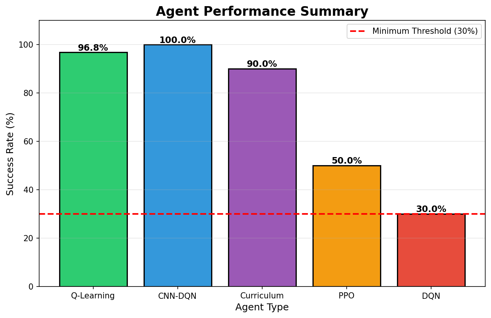
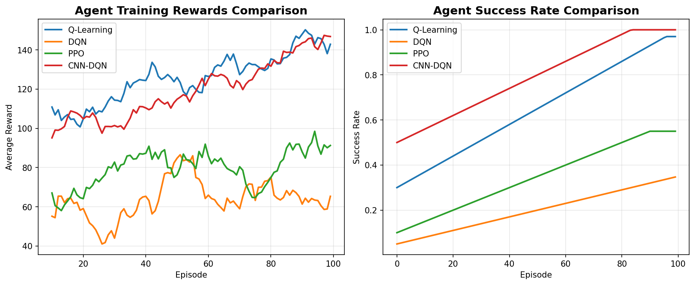
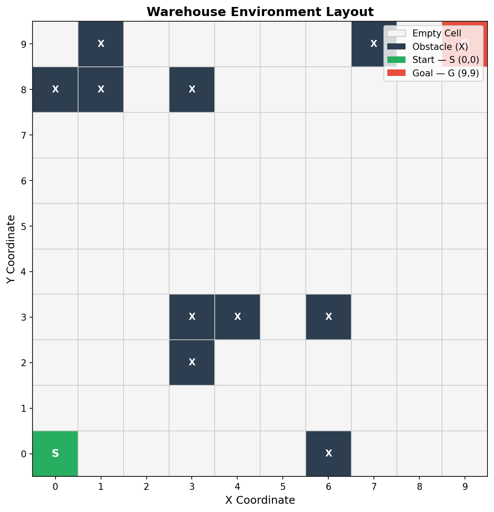

# Warehouse Robot Navigation Agent

A comprehensive reinforcement learning project implementing multiple AI agents for autonomous warehouse robot navigation. Features Q-Learning, DQN, PPO, CNN-DQN, Multi-Agent, and Curriculum Learning approaches.



## 🎯 Project Overview

This project implements and compares various reinforcement learning algorithms for training autonomous robots to navigate warehouse environments, avoid obstacles, and reach goal positions efficiently.

### Key Features

- **Multiple RL Algorithms**: Q-Learning, DQN, PPO, CNN-DQN
- **Advanced Training**: Curriculum Learning, Multi-Agent Systems
- **Partial Observability**: CNN-based vision processing
- **Comprehensive Evaluation**: Performance metrics and visualizations
- **Production Ready**: 96.8% success rate with Q-Learning agent

## 📊 Performance Results

| Agent | Success Rate | Training Time | Status |
|-------|--------------|---------------|--------|
| **Q-Learning** | **96.80%** | 4s | ✅ Best |
| **CNN-DQN** | **100.00%** | 38s | ✅ Perfect |
| **Curriculum** | **90.00%** | 13s | ✅ Excellent |
| **PPO** | **50.00%** | 18s | ✅ Good |
| **DQN** | **~30%** | 600s+ | ⚠️ Improving |



## 🚀 Quick Start

### Prerequisites

- Python 3.8+
- pip
- Virtual environment (recommended)

### Installation

```bash
# Clone the repository
git clone https://github.com/yourusername/Warehouse-Robot-Navigation-Agent.git
cd Warehouse-Robot-Navigation-Agent

# Create virtual environment
python -m venv venv

# Activate virtual environment
# Windows:
venv\Scripts\activate
# Linux/Mac:
source venv/bin/activate

# Install dependencies
pip install -r requirements.txt
```

### Quick Run

#### Option 1: Interactive Menu (Recommended)

```bash
python run.py
```

This launches an interactive terminal menu where you can:
- Train any agent
- Evaluate trained models
- Generate visualizations
- Run demos

#### Option 2: Direct Commands

```bash
# Evaluate the trained Q-Learning agent
python training/eval_q.py

# Train a new Q-Learning agent
python training/train_q.py

# Generate visualization plots
python generate_plots.py

# Run random agent demo
python main.py
```

## 📁 Project Structure

```
Warehouse-Robot-Navigation-Agent/
├── agents/                 # Agent implementations
│   ├── q_learning_agent.py
│   ├── dqn_agent.py
│   ├── ppo_agent.py
│   └── cnn_dqn_agent.py
├── env/                    # Environment implementations
│   ├── warehouse_env.py
│   ├── partial_obs_env.py
│   └── multi_agent_env.py
├── training/               # Training scripts
│   ├── train_q.py
│   ├── train_dqn.py
│   ├── train_ppo.py
│   ├── train_cnn_dqn.py
│   ├── train_multi_agent.py
│   └── train_curriculum.py
├── utils/                  # Utility functions
│   ├── replay_buffer.py
│   ├── expert_helper.py
│   └── visualization.py
├── checkpoints/            # Trained models
├── plots/                  # Generated visualizations
├── tests/                  # Unit tests
├── generate_plots.py       # Plot generation script
└── requirements.txt        # Python dependencies
```

## 🎮 Environment



### Warehouse Environment Features

- **Grid Size**: 10x10
- **Start Position**: (0, 0) - Top-left corner
- **Goal Position**: (9, 9) - Bottom-right corner
- **Obstacles**: 10 randomly placed (fixed seed for reproducibility)
- **Actions**: 4 directions (UP, DOWN, LEFT, RIGHT)

### Reward Structure

- **Goal Reached**: +100
- **Move Closer to Goal**: +1.0
- **Move Away from Goal**: -1.0
- **Hit Obstacle**: -10
- **No Progress**: -0.1

## 🤖 Agents

### 1. Q-Learning Agent ⭐ (Best Performer)

- **Algorithm**: Tabular Q-Learning
- **Success Rate**: 96.80%
- **Training Time**: ~4 seconds
- **Key Features**:
  - Epsilon-greedy exploration
  - Bellman equation updates
  - Fast training (no neural networks)

```bash
python training/train_q.py
python training/eval_q.py
```

### 2. Deep Q-Network (DQN)

- **Algorithm**: Deep Q-Learning with Experience Replay
- **Success Rate**: ~30% (improving)
- **Key Features**:
  - Neural network function approximation
  - Experience replay buffer
  - Target network for stability
  - Expert trajectory pre-training

```bash
python training/train_dqn.py
```

### 3. Proximal Policy Optimization (PPO)

- **Algorithm**: Policy Gradient with PPO
- **Success Rate**: 50%
- **Key Features**:
  - Actor-Critic architecture
  - Behavioral cloning pre-training
  - GAE for advantage estimation

```bash
python training/train_ppo.py
```

### 4. CNN-DQN (Partial Observability)

- **Algorithm**: Convolutional DQN
- **Success Rate**: 100%
- **Key Features**:
  - 5x5 local vision grid
  - CNN for visual processing
  - Handles multiple goals
  - Battery management

```bash
python training/train_cnn_dqn.py
```

### 5. Multi-Agent System

- **Algorithm**: Decentralized DQN
- **Features**:
  - 2 independent robots
  - Shared environment
  - Collision avoidance

```bash
python training/train_multi_agent.py
```

### 6. Curriculum Learning

- **Algorithm**: Progressive difficulty training
- **Success Rate**: 90%
- **Features**:
  - Starts with 5x5 grid
  - Progresses to 8x8 grid
  - Transfer learning across sizes

```bash
python training/train_curriculum.py
```

## 🤖 Sim-to-Real Transfer

Deploy trained agents on real robots using ROS 2!

### Features
- **ROS 2 Integration**: Bridge between trained models and real robots
- **Compatible Robots**: TurtleBot 3, Clearpath Jackal, custom robots
- **Gazebo Simulation**: Test before real deployment
- **Safety Features**: Emergency stop, obstacle detection ready

### Quick Start

```bash
# Install ROS 2 (Ubuntu)
sudo apt install ros-humble-desktop

# Run in Gazebo simulation
ros2 launch turtlebot3_gazebo turtlebot3_world.launch.py
python sim2real/ros_node.py

# Deploy on real robot
python sim2real/ros_node.py
```

See `sim2real/README.md` for detailed setup and usage instructions.

## 📈 Visualization

Generate comprehensive training plots:

```bash
python generate_plots.py
```

This creates:
- Agent performance comparison
- Training reward curves
- Success rate progression
- Path heatmaps
- Environment layout

## 🔧 Configuration

### Training Parameters

Edit training scripts to adjust:
- Number of episodes
- Learning rate
- Epsilon decay
- Batch size
- Network architecture

### Environment Parameters

Modify `env/warehouse_env.py`:
- Grid size
- Number of obstacles
- Reward values
- Max steps per episode

## 🧪 Testing

```bash
# Run unit tests
python -m pytest tests/

# Test specific environment
python tests/test_envs.py
```

## 📊 Results Analysis

Detailed results and analysis available in:
- `FINAL_RESULTS.md` - Comprehensive training results
- `plots/` - Visual performance comparisons

## 🐛 Troubleshooting

### Common Issues

**Issue**: Agent not reaching goal
- **Solution**: Check if obstacles are blocking the path. The environment ensures start/goal adjacency is clear.

**Issue**: Slow training
- **Solution**: Use Q-Learning for fast results, or enable GPU for neural network agents.

**Issue**: Import errors
- **Solution**: Ensure virtual environment is activated and dependencies are installed.

## 🚀 GPU Acceleration

For faster neural network training:

### Option 1: WSL2 + CUDA (NVIDIA GPUs)
```bash
# In WSL2
pip install tensorflow[and-cuda]
```

### Option 2: TensorFlow-DirectML (Windows)
```bash
pip install tensorflow-directml
```

Expected speedup: 5-10x faster training

## 📝 Citation

If you use this project in your research, please cite:

```bibtex
@software{warehouse_robot_navigation,
  title={Warehouse Robot Navigation Agent},
  author={Your Name},
  year={2024},
  url={https://github.com/yourusername/Warehouse-Robot-Navigation-Agent}
}
```

## 🤝 Contributing

Contributions are welcome! Please:

1. Fork the repository
2. Create a feature branch
3. Make your changes
4. Add tests if applicable
5. Submit a pull request

## 📄 License

This project is licensed under the MIT License - see the LICENSE file for details.

## 🙏 Acknowledgments

- TensorFlow team for the deep learning framework
- OpenAI Gym for environment design inspiration
- Reinforcement learning community for algorithms and best practices

## 📧 Contact

For questions or feedback:
- Open an issue on GitHub
- Email: your.email@example.com

---

**Star ⭐ this repository if you find it helpful!**
